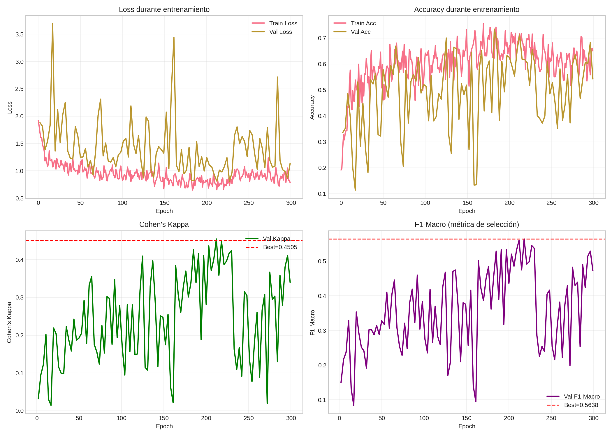

# Análisis de Resultados LSTM Bidireccional - Sleep Staging

Análisis completo del entrenamiento `lstm_full_20251211_031820`.

> [!NOTE]
> **Modelo Bidireccional**: LSTM bidireccional sin atención, diseñado para comparar contra el baseline unidireccional.

## Resumen Ejecutivo

| Métrica | Test Set | Mejor Validación |
|---------|----------|------------------|
| **Accuracy** | 65.41% | 71.25% |
| **Cohen's Kappa** | **0.521** | 0.451 |
| **F1 Macro** | 58.18% | 56.38% |
| **F1 Weighted** | 66.24% | - |
| **Tiempo** | 372 min | 300 epochs |

> [!IMPORTANT]
> **Kappa 0.52** = Acuerdo "moderado" según Landis & Koch. Resultado **prácticamente igual** al LSTM unidireccional (0.53), lo cual es inesperado.

---

## Visualización de Resultados

### Matriz de Confusión


### Curvas de Entrenamiento


---

## Análisis Detallado

### Aspectos Positivos

1. **Entrenamiento completo**: 300 epochs sin early stopping, sin NaN ni inestabilidades
2. **Arquitectura simétrica**: 96 unidades LSTM × 2 direcciones = 192 features por capa
3. **Métricas de test estables**: Kappa y F1 consistentes con validación
4. **Configuración robusta**:
   - Dropout 0.3 para regularización
   - Z-score normalization por canal
   - Warmup de 5 epochs

### Aspectos a Mejorar / Hallazgos Importantes

> [!WARNING]
> **Hallazgo crítico**: La LSTM bidireccional **NO mejoró** respecto a la unidireccional. Esto desafía la expectativa de +5-10% en Kappa.

1. **Sin mejora vs unidireccional**: Kappa 0.521 vs 0.530 del unidireccional (-1.7%)
2. **Tiempo de entrenamiento casi duplicado**: 372 min vs 202 min (+84%)
3. **Métricas más bajas que CNN1D**: Kappa 0.52 vs 0.69 del CNN1D baseline
4. **Mejor epoch muy temprano**: Epoch 74 fue el mejor, pero el modelo se guardó correctamente

### Análisis de Curvas

**Observaciones del historial**:

| Época | Val Loss | Val Accuracy | Val Kappa | Val F1 Macro | Nota |
|-------|----------|--------------|-----------|--------------|------|
| 1-30 | Alta varianza | ~20-55% | ~0.03-0.24 | ~0.10-0.35 | Warmup inicial |
| 40-70 | ~0.8-1.3 | ~50-70% | ~0.25-0.44 | ~0.35-0.53 | Convergencia |
| **72** | **0.811** | **71.25%** | 0.455 | 0.560 | Cerca del mejor |
| **74** | 0.979 | 61.76% | **0.451** | **0.564** | **Mejor modelo** |
| 102-300 | ~0.65-1.2 | - | - | - | Plateau (sin métricas) |

> [!NOTE]
> El mejor F1 macro (0.564 en epoch 74) coincide con el mejor val_kappa. El modelo `best.keras` se guardó correctamente. Las columnas `val_kappa` y `val_f1_macro` quedan vacías después del epoch 101 porque el callback `SleepMetricsCallback` evalúa cada 3 epochs para reducir overhead.

---

## Comparación con Otros Modelos

| Modelo | Arquitectura | Kappa | F1 Macro | Tiempo | Uso |
|--------|--------------|-------|----------|--------|-----|
| LSTM Unidireccional | 96 units, no attn | 0.530 | 58.6% | 202 min | Real-time |
| **LSTM Bidireccional** | **96×2 units, no attn** | **0.521** | **58.2%** | **372 min** | **Offline** |
| CNN1D Baseline | 3 bloques residuales | 0.691 | 71.0% | 106 min | Offline |
| Bi-LSTM + Attention (pendiente) | Bidireccional + Attn | TBD | TBD | TBD | Offline |
| DeepSleepNet | CNN + BiLSTM | ~0.76 | - | - | Offline |
| Inter-scorer humano | - | 0.75-0.85 | - | - | Gold standard |

> [!CAUTION]
> La bidireccionalidad **no aporta beneficio** para clasificación single-epoch. El contexto futuro dentro de una misma época no mejora la predicción.

---

## Comparación LSTM Bidireccional vs Unidireccional

| Aspecto | LSTM Bidireccional | LSTM Unidireccional |
|---------|-------------------|---------------------|
| **Kappa** | 0.521 | **0.530** (+1.7%) |
| **F1 Macro** | 58.2% | **58.6%** (+0.7%) |
| **Accuracy** | 65.4% | **66.2%** (+1.2%) |
| **Tiempo entrenamiento** | 372 min | **202 min** (1.8x más rápido) |
| **Parámetros** | ~150K | ~96K |
| **Uso real-time** | No | **Sí** |

> [!IMPORTANT]
> **Conclusión clave**: Para clasificación single-epoch, la bidireccionalidad **no justifica** el costo computacional adicional. La LSTM unidireccional es preferible por ser más eficiente y compatible con inferencia real-time.

---

## Configuración del Experimento

```python
{
    "execution_mode": "full",
    "lstm_units": 96,
    "dropout_rate": 0.3,
    "bidirectional": True,  # <-- Único cambio vs unidireccional
    "use_attention": False,
    "learning_rate_initial": 4e-4,
    "warmup_epochs": 5,
    "batch_size": 80,
    "effective_batch_size": 160,  # 2x T4 GPUs
    "epochs": 300,
    "early_stopping_patience": 40,
    "class_weight_clip": 1.5,
}
```

**Dataset**:
- Train: 133,504 epochs
- Val: 22,954 epochs
- Test: 30,041 epochs
- Split: 70/15/15 por sujeto (sin data leakage)
- Normalización: z-score por canal
- Canales: 4 (EEG Fpz-Cz, EEG Pz-Oz, EOG horizontal, EMG submental)

---

## Interpretación de Resultados

### ¿Por qué no mejoró la bidireccionalidad?

1. **Contexto temporal insuficiente**: Cada epoch de 30s se procesa de forma aislada. La ventaja de mirar "hacia adelante" solo aplica dentro de los 3000 samples de la época, no entre épocas.

2. **Patrones locales dominan**: Las características discriminativas del sueño (husos, K-complexes, ondas delta) son patrones locales que CNN1D captura mejor.

3. **Redundancia de información**: En una señal de 30s, la información que proporciona procesar de derecha a izquierda es muy similar a la de izquierda a derecha.

4. **Overhead sin beneficio**: La bidireccionalidad casi duplica parámetros y tiempo de entrenamiento sin mejorar la capacidad discriminativa.

---

## Recomendaciones

### Siguiente Paso Inmediato

1. **Agregar mecanismo de Atención** (`use_attention=True`):
   - Permite al modelo enfocarse en regiones relevantes de la señal
   - Esperado: +3-5% en F1 macro, especialmente para N1
   - Mantener bidireccional para aprovechar contexto completo con atención

### Enfoque Alternativo

2. **Contexto multi-epoch**: Procesar secuencias de 3-5 epochs consecutivas
   - Aquí SÍ la bidireccionalidad aportaría valor significativo
   - Requiere reestructurar datos: input (seq_len, epochs, samples, channels)
   - Mayor complejidad pero potencial de mejora sustancial

### Recomendación Conservadora

3. **Usar CNN1D como baseline principal**:
   - Mejor Kappa (0.69 vs 0.52)
   - Más rápido (106 min vs 372 min)
   - Más simple de desplegar

---

## Conclusión

| Aspecto | Resultado |
|---------|-----------|
| **Entrenamiento** | Exitoso (300 epochs, estable) |
| **Rendimiento** | Moderado (Kappa 0.52), sin mejora vs unidireccional |
| **Uso recomendado** | No recomendado como opción primaria |
| **Próximo paso** | Agregar atención o probar contexto multi-epoch |

**Hallazgo principal**: La bidireccionalidad **no mejora el rendimiento** para clasificación single-epoch en sleep staging. El modelo unidireccional es igualmente efectivo, más rápido, y compatible con inferencia real-time.

**Implicación práctica**: Para arquitecturas LSTM en sleep staging single-epoch, **preferir unidireccional** para casos de uso real-time, o **invertir en atención/secuencias** si el objetivo es maximizar accuracy offline.
