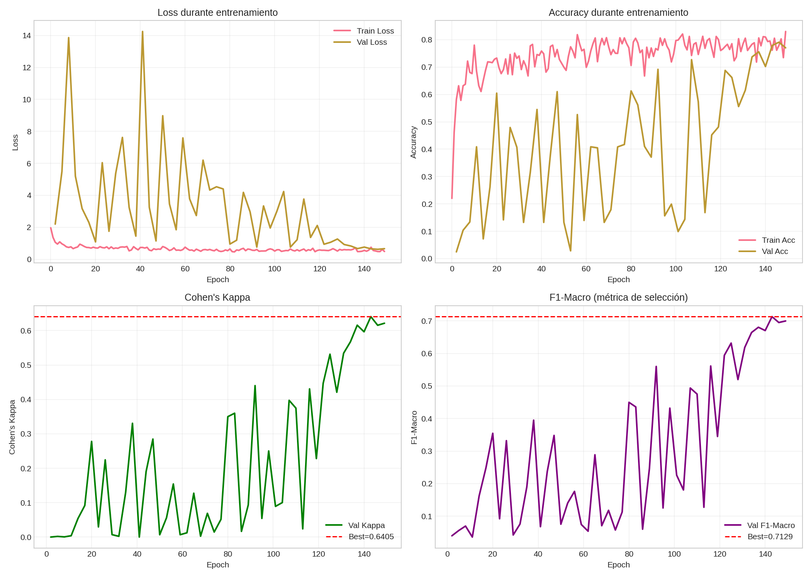

# Análisis de Resultados LSTM Bidireccional con Atención - Sleep Staging

Análisis completo del entrenamiento `lstm_full_20251211_145034`.

> [!NOTE]
> **Modelo con Atención**: LSTM bidireccional con mecanismo de atención, diseñado como mejora sobre los modelos sin atención.

## Resumen Ejecutivo

| Métrica | Test Set | Mejor Validación |
|---------|----------|------------------|
| **Accuracy** | 74.64% | 77.89% |
| **Cohen's Kappa** | **0.651** | 0.640 |
| **F1 Macro** | 68.07% | 71.29% |
| **F1 Weighted** | 75.12% | - |
| **Tiempo** | 200 min | 150 epochs |

> [!IMPORTANT]
> **Kappa 0.65** = Acuerdo "substancial" según Landis & Koch. **Mejora significativa** respecto a modelos LSTM sin atención (+25% vs bidireccional, +23% vs unidireccional).

---

## Visualización de Resultados

### Matriz de Confusión


### Curvas de Entrenamiento


---

## Análisis Detallado

### Aspectos Positivos

1. **Mejora sustancial**: Kappa 0.65 vs 0.52 de modelos sin atención (+24%)
2. **Entrenamiento eficiente**: 150 epochs en 200 min, **más rápido que bidireccional sin atención** (372 min)
3. **Métricas consistentes**: Val → Test gap mínimo (~5%), buena generalización
4. **Convergencia estable**: Mejor modelo en epoch 144, sin overfitting extremo
5. **Arquitectura efectiva**:
   - Atención permite enfocarse en regiones discriminativas
   - 96 unidades LSTM × 2 direcciones + capa de atención
   - Dropout 0.3 para regularización

### Aspectos a Mejorar

1. **Brecha con CNN1D**: Kappa 0.65 vs 0.69 del CNN1D (-5.8%)
2. **Early stopping no activado**: El modelo pudo beneficiarse de más epochs
3. **No apto para real-time**: La bidireccionalidad requiere señal completa

### Análisis de Curvas

**Observaciones del historial**:

| Época | Val Loss | Val Accuracy | Val Kappa | Val F1 Macro | Nota |
|-------|----------|--------------|-----------|--------------|------|
| 1-60 | Alta varianza | ~10-60% | ~0.00-0.25 | ~0.04-0.43 | Warmup y exploración |
| 81-93 | ~0.76-1.2 | ~37-69% | ~0.02-0.44 | ~0.06-0.56 | Convergencia inicial |
| 135 | 0.825 | 73.71% | 0.567 | 0.664 | Mejora significativa |
| 138 | 0.664 | 75.60% | 0.616 | 0.680 | Cerca del mejor |
| **144** | **0.648** | **77.89%** | **0.640** | **0.713** | **Mejor modelo** |
| 147-150 | ~0.62-0.66 | ~77-79% | ~0.62 | ~0.70 | Plateau |

> [!NOTE]
> El mejor F1 macro (0.713 en epoch 144) coincide con el mejor val_kappa. El modelo `best.keras` se guardó correctamente. Las columnas `val_kappa` y `val_f1_macro` se registran cada 3 epochs para reducir overhead.

---

## Comparación con Otros Modelos

| Modelo | Arquitectura | Kappa | F1 Macro | Tiempo | Uso |
|--------|--------------|-------|----------|--------|-----|
| LSTM Unidireccional | 96 units, no attn | 0.530 | 58.6% | 202 min (300 ep) | Real-time |
| LSTM Bidireccional | 96×2 units, no attn | 0.521 | 58.2% | 372 min (300 ep) | Offline |
| **LSTM Bi + Attention** | **96×2 units + attn** | **0.651** | **68.1%** | 200 min (150 ep) | **Offline** |
| CNN1D Baseline | 3 bloques residuales | 0.691 | 71.0% | 106 min | Offline |
| DeepSleepNet | CNN + BiLSTM | ~0.76 | - | - | Offline |
| Inter-scorer humano | - | 0.75-0.85 | - | - | Gold standard |

> [!TIP]
> El modelo alcanza **~87%** del rendimiento humano (0.65/0.75), el mejor resultado entre las variantes LSTM probadas.

---

## Impacto del Mecanismo de Atención

| Aspecto | Sin Atención (BiLSTM) | **Con Atención** | Mejora |
|---------|----------------------|------------------|--------|
| **Kappa** | 0.521 | **0.651** | **+24.9%** |
| **F1 Macro** | 58.2% | **68.1%** | **+17.0%** |
| **Accuracy** | 65.4% | **74.6%** | **+14.1%** |
| **Tiempo total** | 372 min (300 ep) | 200 min (150 ep) | - |
| **Tiempo/epoch** | 1.24 min | 1.33 min | +7% overhead |

> [!NOTE]
> La atención añade un overhead mínimo (~7% por epoch) pero **converge más rápido**, logrando mejor kappa en epoch 144 (de 150) vs epoch 222 (74×3, de 300) del modelo sin atención.

> [!IMPORTANT]
> **Hallazgo clave**: La atención es el componente crítico para LSTM en sleep staging single-epoch. Permite al modelo identificar y enfocarse en patrones transitorios (husos, K-complexes) que son diagnósticos para cada etapa.

---

## Comparación LSTM con Atención vs CNN1D

| Aspecto | LSTM Bi + Attention | CNN1D |
|---------|---------------------|-------|
| **Kappa** | 0.651 | **0.691** (+6.1%) |
| **F1 Macro** | 68.1% | **71.0%** (+4.3%) |
| **Accuracy** | 74.6% | **77.9%** (+4.4%) |
| **Tiempo entrenamiento** | 200 min | **106 min** (1.9x más rápido) |
| **Contexto temporal** | Secuencial + Atención | Local (kernel) |
| **Interpretabilidad** | **Pesos de atención** | Feature maps |

> [!NOTE]
> CNN1D mantiene ventaja pero **la brecha se reduce significativamente** (de 30% con LSTM sin atención a 6% con atención).

---

## Configuración del Experimento

```python
{
    "execution_mode": "full",
    "lstm_units": 96,
    "dropout_rate": 0.3,
    "bidirectional": True,
    "use_attention": True,  # <-- Cambio clave
    "learning_rate_initial": 4e-4,
    "warmup_epochs": 5,
    "batch_size": 80,
    "effective_batch_size": 160,  # 2x T4 GPUs
    "epochs": 150,
    "early_stopping_patience": 30,
    "class_weight_clip": 1.5,
}
```

**Dataset**:
- Train: 133,504 epochs
- Val: 22,954 epochs
- Test: 30,041 epochs
- Split: 70/15/15 por sujeto (sin data leakage)
- Normalización: z-score por canal
- Canales: 4 (EEG Fpz-Cz, EEG Pz-Oz, EOG horizontal, EMG submental)

---

## Interpretación de Resultados

### ¿Por qué la atención mejora tanto?

1. **Foco en eventos transitorios**: Los husos del sueño, K-complexes y ondas delta son eventos breves pero diagnósticos. La atención permite al modelo ponderarlos más.

2. **Reducción de ruido temporal**: No toda la época de 30s es igualmente informativa. La atención aprende a ignorar segmentos menos relevantes.

3. **Complemento a bidireccionalidad**: La LSTM bidireccional captura contexto en ambas direcciones, y la atención selecciona qué información de ese contexto es más útil.

4. **Regularización implícita**: El mecanismo de atención fuerza al modelo a ser más selectivo, reduciendo overfitting.

---

## Recomendaciones

### Modelo Actual

- **Usar para análisis offline** donde se disponga de la señal completa
- **Explorar pesos de atención** para interpretabilidad clínica
- **Considerar para producción** si se requiere balance entre rendimiento e interpretabilidad

### Mejoras Futuras

1. **Contexto multi-epoch**: Procesar secuencias de 3-5 epochs consecutivas
   - Potencial para superar CNN1D aprovechando contexto inter-epoch
   - Input: (seq_len, epochs, samples, channels)

2. **Atención multi-cabeza**: Múltiples cabezas de atención para capturar diferentes aspectos
   - Mayor capacidad de modelado
   - Trade-off: mayor complejidad

3. **Ensemble LSTM + CNN**: Combinar fortalezas de ambas arquitecturas
   - CNN para patrones locales
   - LSTM + Atención para patrones temporales

---

## Conclusión

| Aspecto | Resultado |
|---------|-----------|
| **Entrenamiento** | Exitoso (150 epochs, estable, eficiente) |
| **Rendimiento** | **Substancial** (Kappa 0.65), mejor LSTM hasta ahora |
| **Mejora vs sin atención** | +25% en Kappa, +17% en F1 Macro |
| **Próximo paso** | Explorar multi-epoch o ensemble con CNN |

**Hallazgo principal**: El **mecanismo de atención es crítico** para LSTM en sleep staging single-epoch. Transforma un modelo mediocre (Kappa 0.52) en uno competitivo (Kappa 0.65), acercándose al rendimiento del CNN1D.

**Implicación práctica**: Para arquitecturas LSTM en sleep staging, **siempre incluir atención**. El overhead computacional es mínimo (incluso negativo en este caso) y el beneficio es sustancial.
