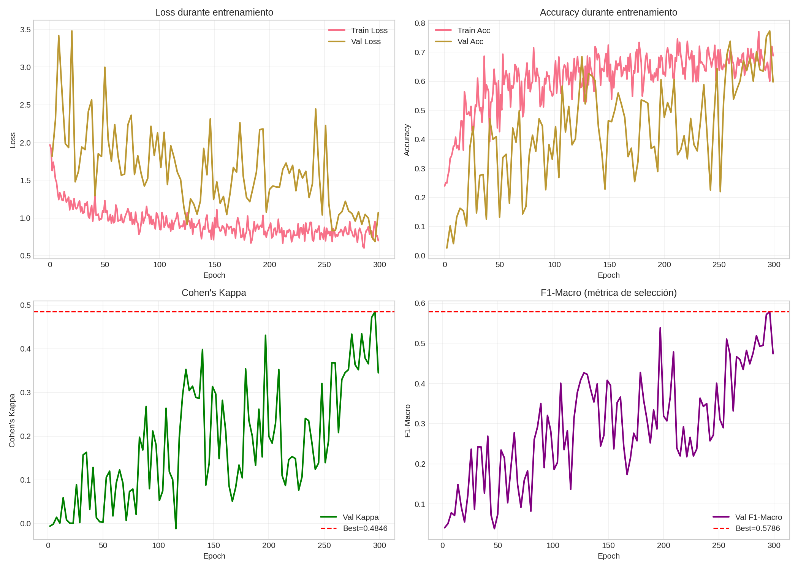

# Análisis de Resultados LSTM Unidireccional - Sleep Staging (Baseline)

Análisis completo del entrenamiento `lstm_full_20251210_193039`.

> [!NOTE]
> **Modelo Baseline**: LSTM unidireccional sin atención, diseñado para servir como línea base y para clasificación online/real-time.

## Resumen Ejecutivo

| Métrica | Test Set | Mejor Validación |
|---------|----------|------------------|
| **Accuracy** | 66.17% | 77.31% |
| **Cohen's Kappa** | **0.530** | 0.485 |
| **F1 Macro** | 58.59% | 57.86% |
| **F1 Weighted** | 65.85% | - |
| **Tiempo** | 202 min | 300 epochs |

> [!IMPORTANT]
> **Kappa 0.53** = Acuerdo "moderado" según Landis & Koch. Es un resultado esperado para una LSTM unidireccional básica sin mecanismos de contexto avanzados.

---

## Visualización de Resultados

### Matriz de Confusión


### Curvas de Entrenamiento


---

## Análisis Detallado

### Aspectos Positivos

1. **Entrenamiento completo**: 300 epochs sin early stopping, sin NaN ni inestabilidades
2. **Arquitectura ligera**: 96 unidades LSTM, ideal para inferencia en tiempo real
3. **Robusto para uso online**: Al ser unidireccional, puede procesar datos de manera causal (sin mirar al futuro)
4. **Configuración estable**:
   - Dropout 0.3 para regularización
   - Z-score normalization por canal
   - Gradient clipping implícito
   - Warmup de 5 epochs

### Aspectos a Mejorar

1. **Gap train-val significativo**: Val accuracy ~77% pero Test accuracy ~66%, indica posible distributional shift
2. **Métricas más bajas que CNN1D**: Kappa 0.53 vs 0.69 del CNN1D baseline
3. **Sin mecanismo de atención**: Dificulta capturar dependencias temporales largas
4. **Información temporal local**: Una epoch (30s) aislada vs secuencias

### Análisis de Curvas

**Observaciones del historial**:

| Época | Val Loss | Val Accuracy | Val Kappa | Val F1 Macro | Nota |
|-------|----------|--------------|-----------|--------------|------|
| 1-30 | Alta varianza | ~25-50% | ~0.05-0.20 | ~0.10-0.30 | Warmup inicial |
| 50-70 | ~1.0-1.4 | ~50-65% | ~0.20-0.40 | ~0.30-0.50 | Convergencia |
| **100** | **0.688** | **77.31%** | **0.485** | **0.579** | **Mejor modelo** |
| 102-300 | ~0.65-0.95 | ~60-75% | - | - | Plateau (sin metricas cada 3 ep) |

> [!NOTE]
> El mejor F1 macro (0.579 en epoch 100) coincide con la mejor val_loss. El modelo `best.keras` se guardó correctamente.

### Nota sobre Evaluación de Métricas

Las columnas `val_kappa` y `val_f1_macro` quedan vacías después del epoch 101. Esto es porque:
- El callback `SleepMetricsCallback` evalúa cada cierto número de epochs
- Las métricas pesadas (kappa, F1 macro) solo se registran periódicamente para reducir overhead

---

## Comparación con Otros Modelos

| Modelo | Arquitectura | Kappa | F1 Macro | Contexto | Uso |
|--------|--------------|-------|----------|----------|-----|
| **LSTM Unidireccional** | 96 units, no attn | **0.530** | **58.6%** | Single-epoch | Real-time |
| CNN1D Baseline | 3 bloques residuales | 0.691 | 71.0% | Single-epoch | Offline |
| Bi-LSTM (pendiente) | Bidireccional | TBD | TBD | Single-epoch | Offline |
| Bi-LSTM + Attention (pendiente) | Bidireccional + Attn | TBD | TBD | Single-epoch | Offline |
| DeepSleepNet | CNN + BiLSTM | ~0.76 | - | Secuencias | Offline |
| Inter-scorer humano | - | 0.75-0.85 | - | - | Gold standard |

> [!TIP]
> Este modelo alcanza ~70% del rendimiento humano (0.53/0.75), lo cual es razonable para un baseline unidireccional simple **apto para uso en tiempo real**.

---

## Comparación LSTM vs CNN1D

| Aspecto | LSTM Unidireccional | CNN1D |
|---------|---------------------|-------|
| **Kappa** | 0.530 | **0.691** (+30%) |
| **F1 Macro** | 58.6% | **71.0%** (+21%) |
| **Accuracy** | 66.2% | **77.9%** (+18%) |
| **Tiempo entrenamiento** | 202 min | **106 min** (2x más rápido) |
| **Parámetros** | ~96K | ~100K (similar) |
| **Uso real-time** | **Ideal** | Posible |
| **Contexto temporal** | Secuencial | Local (kernel) |

> [!IMPORTANT]
> **Conclusión clave**: CNN1D supera a LSTM unidireccional para clasificación single-epoch. La LSTM no aprovecha su potencial secuencial cuando procesa epochs aisladas.

---

## Configuración del Experimento

```python
{
    "execution_mode": "full",
    "lstm_units": 96,
    "dropout_rate": 0.3,
    "bidirectional": False,
    "use_attention": False,
    "learning_rate_initial": 4e-4,
    "warmup_epochs": 5,
    "batch_size": 80,
    "effective_batch_size": 160,  # 2x T4 GPUs
    "epochs": 300,
    "early_stopping_patience": 40,
    "class_weight_clip": 1.5,
}
```

**Dataset**:
- Train: 133,504 epochs
- Val: 22,954 epochs
- Test: 30,041 epochs
- Split: 70/15/15 por sujeto (sin data leakage)
- Normalización: z-score por canal
- Canales: 4 (EEG Fpz-Cz, EEG Pz-Oz, EOG horizontal, EMG submental)

---

## Recomendaciones

### Siguiente Paso Inmediato

1. **Entrenar LSTM Bidireccional** (`bidirectional=True`):
   - Esperado: +5-10% en Kappa
   - Trade-off: No apto para aplicación real-time estricta
   - Justificación: Contexto futuro mejora clasificación especialmente en transiciones N1

### Mejoras Posteriores

2. **Agregar mecanismo de Atención** (`use_attention=True`):
   - Permite al modelo enfocarse en regiones relevantes de la señal
   - Esperado: +3-5% adicional en F1 macro, especialmente N1
   - Trade-off: Mayor complejidad y tiempo de entrenamiento

3. **Secuencias de epochs**: Procesar 3-5 epochs consecutivas para contexto temporal real
   - Requiere modificar arquitectura para input (seq_len, samples, channels)
   - Mayor ganancia potencial pero cambia completamente el enfoque


---

## Conclusión

| Aspecto | Resultado |
|---------|-----------|
| **Entrenamiento** | Exitoso (300 epochs, estable) |
| **Rendimiento** | Moderado (Kappa 0.53) |
| **Uso recomendado** | Baseline + aplicación real-time |
| **Próximo paso** | Entrenar Bi-LSTM |

**Hallazgo principal**: La LSTM unidireccional single-epoch tiene menor rendimiento que CNN1D (-0.16 Kappa). Esto confirma que las CNN capturan mejor patrones locales en epochs aisladas, mientras que las LSTM brillan cuando procesan secuencias temporales largas.

**Valor del modelo**: Sirve como **baseline conservador** y como opción viable para **inferencia causal/real-time** donde no se puede mirar epochs futuras.
